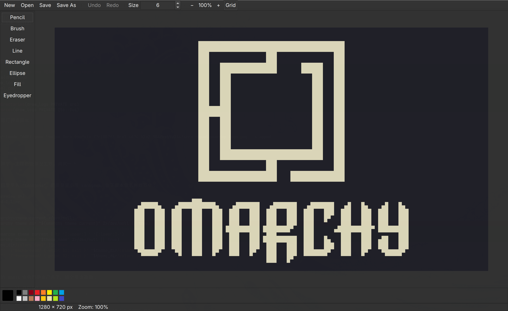

# OmaPaint

> Paint. For Omarchy.



*The Omarchy logo above was drawn by OmaPaint's own rectangle and fill tools,
in the current Omarchy theme's colors — regenerate it with
`./devtools/readme-preview.sh`.*

OmaPaint is a small, native image editor for [Omarchy](https://omarchy.org).
It aims to fill the role classic Paint once filled on Windows: open an image,
draw on it, crop it, add a label or arrow, copy it, save it, get out of the way.

It is not trying to be Krita or GIMP — no layers, no filters, no plugins.
Just a fast, obvious utility that shares Omarchy's theme and technology stack
(Qt 6 / QML, like Omarchy's Quickshell).

## Status

**v0.0.2 — Basic Paint.** A usable small paint program: pencil, brush,
eraser, line, rectangle, ellipse, flood fill, and eyedropper; brush size;
a classic quick-access color palette; zoom from 25% to 1600% with an optional
pixel grid; undo/redo across every tool; PNG open/save with unsaved-changes
protection. See [PLAN.md](PLAN.md) for the goals, architecture, and milestone
roadmap.

## Building

Requires Qt 6.5+ (`qt6-base`, `qt6-declarative`), CMake, and a C++ compiler.

```bash
cmake -S . -B build -G Ninja -DCMAKE_BUILD_TYPE=Release
cmake --build build
./build/omapaint              # blank canvas
./build/omapaint image.png    # edit an image
./build/omapaint --new 800x600
ctest --test-dir build        # run the tests
```

## Planned highlights

- Blank-canvas drawing and quick edits of existing images (PNG, JPEG, WebP).
- Classic Paint toolset: pencil, brush, shapes, fill, selection, text, arrow, crop.
- Optional screenshot annotation via Omarchy's `$OMARCHY_SCREENSHOT_EDITOR` hook.
- Omarchy theme integration, with graceful fallback outside Omarchy.

## Contributing

The project is meant to be small enough to understand and easy to contribute
to. Until code lands, the best contribution is feedback on
[PLAN.md](PLAN.md) — open an issue.

## License

[MIT](LICENSE)
