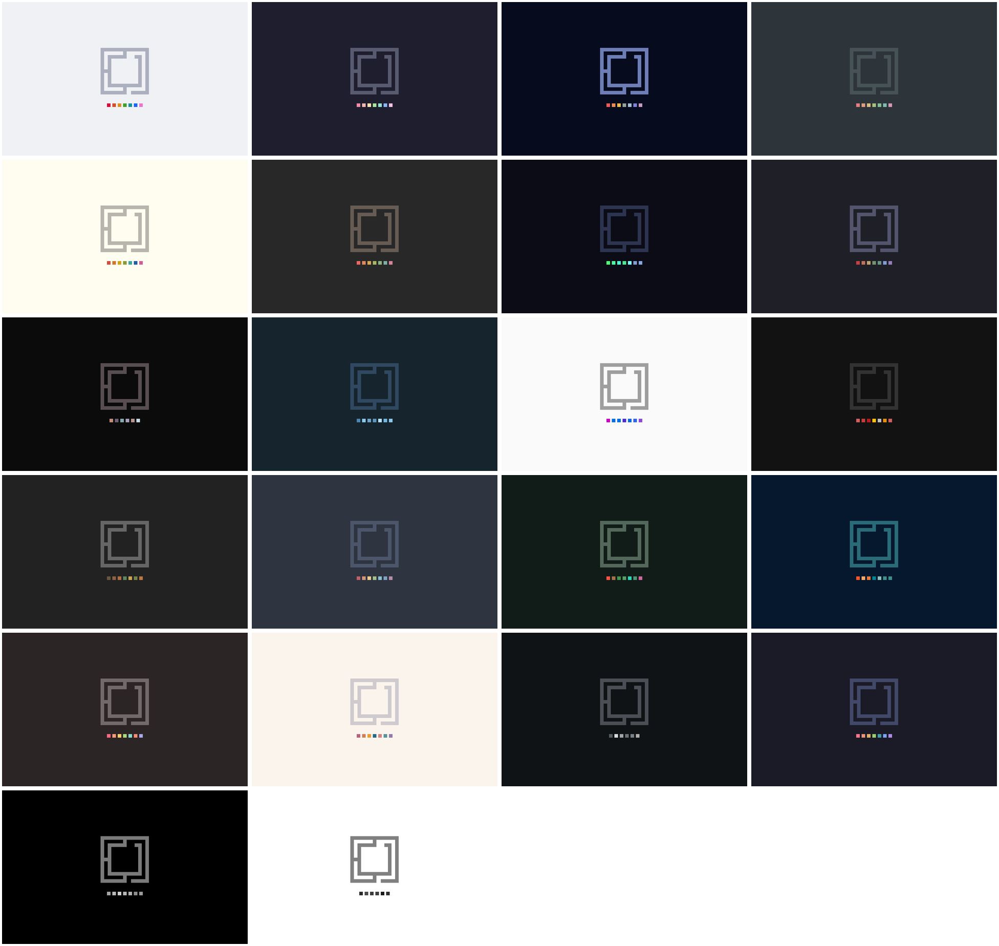

# OmaPaint

> Paint. For Omarchy.


*The brand image above was drawn by OmaPaint's own brush, ellipse, rectangle,
and text tools, in the current Omarchy theme's colors — the wordmark borrows
the Omarchy logo's pixel letterforms. Regenerate it with
`./devtools/readme-preview.sh`. The red paint dot is named Ruby, after a
chubby white cat with a ruby-red harness. She appears in the demo, in pixels.*

OmaPaint is a small, native image editor for [Omarchy](https://omarchy.org).
It aims to fill the role classic Paint once filled on Windows: open an image,
draw on it, crop it, add a label or arrow, copy it, save it, get out of the way.

It is not trying to be Krita or GIMP — no layers, no filters, no plugins.
Just a fast, obvious utility that shares Omarchy's theme and technology stack
(Qt 6 / QML, like Omarchy's Quickshell).

## Status

**v0.2.0 — Everyday Edges.** Rotate and flip (with undo, like everything
else), EXIF orientation respected on load, drag-and-drop a file onto the
window, and stdin piping: `wl-paste | omapaint -`.

**v0.1.0 — Omarchy Native** made OmaPaint feel like part of the desktop:
it follows the active Omarchy theme's `colors.toml` live (falling back to the
system palette elsewhere), ships a `.desktop` entry with PNG/JPEG/WebP MIME
associations, an Arch `PKGBUILD`, and an `omapaint-edit` hook for Omarchy's
screenshot pipeline. Every tool icon — and the app logo — was drawn with
OmaPaint's own tools (`devtools/draw_icons`). The full editor underneath:
text, arrows, filled shapes, pixelate, selection with floating move,
cut/copy/paste, crop, resize, PNG/JPEG/WebP, pencil/brush/eraser/shapes/fill,
zoom 25%–1600% with a pixel grid, and undo/redo across every tool. See
[PLAN.md](PLAN.md) for the goals, architecture, and milestone roadmap.

## Installing on Arch / Omarchy

```bash
git clone https://github.com/ya-luotao/omapaint
cd omapaint/packaging/arch && makepkg -si
```

To make OmaPaint your screenshot annotation editor:

```bash
omapaint-edit --install    # undo with: omapaint-edit --uninstall
```

This writes `~/.config/uwsm/env.d/20-omapaint` (setting
`OMARCHY_SCREENSHOT_EDITOR=omapaint-edit`) and takes effect at your next
login; until then, `omarchy screenshot --editor=omapaint-edit` uses it for
a single shot. In annotate mode, **Done**
(Ctrl+Enter) saves in place and the result lands on your clipboard.

For quick paint sessions, a Hyprland binding pairs well with the clipboard
flow — `SUPER + ALT + P` is unused by Omarchy's defaults:

```lua
-- ~/.config/hypr/bindings.lua
o.bind("SUPER + ALT + P", "Paint clipboard image", "omapaint --clipboard")
```

`omapaint --clipboard` opens whatever image is on the clipboard (a blank
canvas plus a notice when there is none); `wl-paste | omapaint -` does the
same via stdin.

## Building

Requires Qt 6.5+ (`qt6-base`, `qt6-declarative`), CMake, and a C++ compiler.

```bash
cmake -S . -B build -G Ninja -DCMAKE_BUILD_TYPE=Release
cmake --build build
./build/omapaint              # blank canvas
./build/omapaint image.png    # edit an image
./build/omapaint --new 800x600
wl-paste | ./build/omapaint - # edit the clipboard via stdin
ctest --test-dir build        # run the tests
```

## Planned highlights

- Blank-canvas drawing and quick edits of existing images (PNG, JPEG, WebP).
- Classic Paint toolset: pencil, brush, shapes, fill, selection, text, arrow, crop.
- Optional screenshot annotation via Omarchy's `$OMARCHY_SCREENSHOT_EDITOR` hook.
- Omarchy theme integration, with graceful fallback outside Omarchy.

## Theme wallpapers

A wallpaper for every Omarchy theme — each one painted by OmaPaint's own
rectangle and fill tools, in that theme's colors:



Paint one for *your* current theme, sized to your monitor:

```bash
devtools/wallpaper.sh
```

*Regenerate the gallery above with `./devtools/wallpaper-gallery.sh`.*

## Contributing

The project is meant to be small enough to understand and easy to contribute
to. Until code lands, the best contribution is feedback on
[PLAN.md](PLAN.md) — open an issue.

## License

[MIT](LICENSE)
